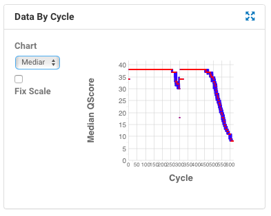

# Processing HybSeq Illumina Reads

### Learning Objectives

1.	Evaluate a sequencing run with Illumina BaseSpace and FASTQC
2.	Demultiplex reads, trim adapters, and filter poor quality reads with Trimmomatic.

## Illumina BaseSpace

Some clue about the effectiveness of a sequencing run can be assessed from BaseSpace, the web-based service provided by Illumina: https://basespace.illumina.com

One common issue arises with the MiSeq 2x300 bp paired-end sequences, where the reverse read has much less quality than the forward read:



Sequencing quality generally drops towards the end of reads, but in this case the reverse read (cycles 301-600) is much worse. Note that removing poor quality reverse reads will result in deletion of many forward reads that are just fine-- some methods for adapting to this situation will be discussed below.

## Demultiplexing

For some sequencing platforms, such as Illumina MiSeq, the reads are returned already demultiplexed. However, this relies on there being no mistakes in your original sample sheet. For more control, we recommend `bcl2fasta` which is [available on the Illumina website](https://support.illumina.com/sequencing/sequencing_software/bcl2fastq-conversion-software.html). This will allow you to specify a correct sample sheet, and will return a list of "unidentified indices" to help you identify mistakes. Another advantage is that you can download the entire run (as flow cell intensities) just once.

## Example Sequences

Download example sequences for this workshop to your Atmosphere image:

```
cd
wget http://de.cyverse.org/dl/d/C4416643-CA5C-4CDD-9FB0-86520AB61059/example_reads.tar.gz
tar -zxvf example_reads.tar.gz
```


## FastQC

FastQC (https://www.bioinformatics.babraham.ac.uk/projects/fastqc/) is a java package for quickly visualizing a sequencing run.

On the Atmosphere virtual machine, FastQC can be accessed via the Applications menu (under Other). Open FASTQC and navigate to the directory that contains the read files. Open one of the read files and wait for FastQC to process. 

#### Basic Statistics

The first tab of FastQC shows basic statistics about the read file-- how many reads, the type of quality score encoding, read length, and GC content.

#### Per-base sequence quality

This graph shows the mean quality score of bases at each position in the read, summarized over all reads. Phred quality scores correspond to the following error probabilities:

Phred Score | Error Probability | Call Accuracy
--- | --- | ---
10 | 1 in 10 | 90%
20 | 1 in 100 | 99%
30 | 1 in 1000 | 99.9%
40 | 1 in 10000 | 99.99%

Illumina sequencers tend to have average quality scores fall as the read gets longer. For paired-end sequencing runs, this may be compounded during the reverse read. In our experience, read 2 from Illumina MiSeq 2x300 is particularly troublesome.

#### Per-sequence quality scores
A histogram of mean quality scores by read. This will show whether there is a large subset of reads with low quality scores, and will inform parameter choices for quality trimming software.

This section will trigger a warning if the mode of the histogram is less than 27, corresponding to a 0.2% error rate.

#### Per-base sequence content

Shows the proportion of A, C, T, and G at each position in the read. A good run with accurate trimming should have no bias at any position. A large bias at the beginning of the read may indicate that adapter and barcode sequences may not have been removed prior to analysis.

The section will trigger a warning if any position (A/T or C/G) is biased by more than 20%.

#### Per-base GC Content

A histogram of GC content for all reads, compared to a theoretical normal distribution estimated from a subset of the reads. A high divergence between the estimated and observed GC content can suggest contamination.

This panel is more useful for full-genome sequencing projects, which are frequently contaminated with microbial DNA that has a different GC content than the study species. 

#### Per-base N content

For each position in the reads, this panel shows the proportion of Ns (unknown base calls). A large proportion of Ns throughout the sequence suggests a failed run, while a higher proportion at the ends of reads suggests the readsZzz should be trimmed before further analysis.

#### Sequence Length Distribution

This panel shows a histogram of sequence lengths. It will be very boring for raw Illumina reads, which should all be the same length! This panel would be more useful if FastQC is run *after* quality trimming, and is also useful on platforms with variable length (e.g. PacBio, Nanopore, 454).

#### Duplicate Sequences

This panel shows the frequency of duplicated sequences among the first 100,000 reads in the file. In genome sequencing, the graph should have an inverse-gamma shape: a high proportion of singleton sequences, with a gradually falling proportion of sequences with duplicates.

In HybSeq, there is a large amount of sequence duplication due to PCR in both the library prep and hybridization phases. As a result the graph will likely look like a broad U, indicating many sequences are duplicated 10+ times. Although FastQC will display a warning, this can be safely ignored for HybSeq data.

#### Overrepresented Sequences

The first 100,000 reads are analyzed for sequences that occur in more than 0.1% of the reads. The most frequent source of overrepresented sequences is adapters, but there may occasionally be overrepresented target fragments due to PCR duplication.


#### Adapter Content

This panel will identify whether any common adapter sequences can be identified in the reads. An abundance of adapter sequences suggests the reads need to be cleaned before full analysis. A high proportion of adapter sequences will also obscure problems with overrepresented sequences or Kmers.

In HybSeq, a large proportion of adapter sequences may suggest library preparation failed, resulting in a library of adapter dimers.

#### Kmer Content

Shows the presence of selected kmers by position in the reads.

Kmers may be biased in HybSeq because of the high amount of PCR duplication during library prep and hybridization. This panel is not typically used to evaluate the success of HybSeq sequencing.

Libraries derived from random priming, including TruSeq Nano, will always show a kmer bias at the beginning of a library. This is because the the "random" priming is actually biased to certain primers over others.

#### Per Tile Sequence Quality

This heatmap shows deviations from average read quality based on the position in the Illumina flow cell. Each row is a flow cell position ID, and each column is the position in the read. Red colors may indicate some tiles have highly reduced quality, and perhaps all sequences with these identifiers should be removed.

## Trimmomatic

Trimmomatic (http://www.usadellab.org/cms/?page=trimmomatic) is a java program for trimming high-throughput sequencing reads. In addition to trimming adapters and barcodes, Trimmomatic will trim and filter sequences based on a series of user-supplied thresholds. One of the best features of Trimmomatic is the ability to retain paired-end information after filtering.

On the Atmosphere workshop instance, trimmomatic is located here: 

`/usr/local/java/trimmomatic-0.35.jar`

#### Sample Trimmomatic Command

```
java -jar trimmomatic-0.35.jar \
PE -phred33 \
input_forward.fq.gz \
input_reverse.fq.gz \
output_forward_paired.fq.gz \
output_forward_unpaired.fq.gz \
output_reverse_paired.fq.gz \
output_reverse_unpaired.fq.gz \
ILLUMINACLIP:TruSeq3-PE.fa:2:30:10 \
LEADING:3 \
TRAILING:3 \
SLIDINGWINDOW:4:15 \
MINLEN:36
```

After the java call, the first argument tells Trimmomatic what type of quality scores are in the file. The best way to know whether `-phred33` or `-phred64` should be used is to use the output of FastQC. The files for this tutorial, which came from an Illumina MiSeq 2x300 run, are `-phred64`.

The next six arguments are input and output file names in a specific order:

1. Forward reads
2. Reverse reads
3. Filtered paired forward reads 
4. Filtered unpaired forward reads
5. Filtered paired reverse reads
6. Filtered unpaired reverse reads

The two filtered paired read files will contain reads where *both* members of a pair passed all filters. The unpaired files will contain reads where either the forward or reverse read passed filter, but the paired read did not.

Each of the next arguments is a filter for the reads. Each filter is executed in the order presented on the command line. In the command above, the Illumina clipping is done before the reads are quality-trimmed. A final filter removes all reads that are less than 36bp.

A full list of possible filter commands is below:

* ILLUMINACLIP: Cut adapter and other illumina-specific sequences from the read.
* SLIDINGWINDOW: Perform a sliding window trimming, cutting once the average quality within the window falls below a threshold.
* LEADING: Cut bases off the start of a read, if below a threshold quality
* TRAILING: Cut bases off the end of a read, if below a threshold quality
* CROP: Cut the read to a specified length
* HEADCROP: Cut the specified number of bases from the start of the read
* MINLEN: Drop the read if it is below a specified length
* TOPHRED33: Convert quality scores to Phred-33
* TOPHRED64: Convert quality scores to Phred-64

#### Exercise: Trimming HybSeq Reads

From the command line on the Atmosphere image, navigate to the directory with the example reads. **Construct a command line for trimmomatic and execute it.**

How many forward and reverse reads were removed?

Try a few variations of the command to see how the parameters affect read trimming. How strict is too strict?


#### Questions

* Was there a substantial difference in filtered read counts between forward and reverse reads?

* How did the FastQC report inform your choices for trimming thresholds?


## Further Reading

Bolger, A. M., Lohse, M., & Usadel, B. (2014). Trimmomatic: A flexible trimmer for Illumina Sequence Data. Bioinformatics 30 (15):2114–2120. 
