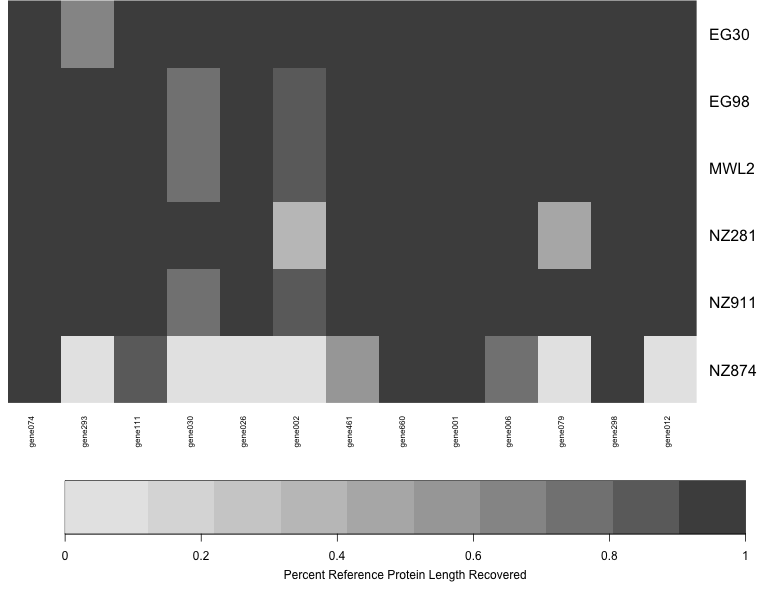

# From Reads to Sequences with HybPiper

## Learning Objectives

1.	Construct a target file for HybPiper.
2.	Run HybPiper for multiple samples and evaluate enrichment efficiency and target recovery efficiency.
3.	Extract intron sequences and identify putative paralogous copies.
4.	Prepare multiple sequence alignments for phylogenetic analysis.

More information and the software package can be accessed at: https://github.com/mossmatters/HybPiper

**On the Atmosphere instance, HybPiper is located here: `/usr/local/HybPiper`** 

## Test Dataset

in the HybPiper package downloaded from the repository, in the `test_dataset` directory:

**`test_reads_fastq.tar.gz`** contains paired reads from nine samples chosen from the initial HybPiper manuscript. It includes six "ingroup" samples (genus *Artocarpus*) and three outgroup samples. Each sample has a pair of `fastq` files, representing the forward and reverse read, generated on an Illumina MiSeq 2x300 platform. **Note**: If you cloned this git repository and do not have the "large file storage" add-on to git, the `test_reads_fastq.tar.gz` file in your repository will **NOT** be a real compressed archive. Please download the reads from the link above! 

**`test_targets.fasta`** is a file containing the full coding sequence from 13 target genes based on the Artocarpus probe set described in the HybPiper manuscript. There are two "sources" of sequence for each target: *Artocarpus* (sequences from a draft genome in the target group) and *Morus* (a reference genome in the same family as *Artocarpus*). For example, both of these sequences represent `gene002`:

```
>Artocarpus-gene002
ATGATGAAGCAGGACGCCACCAACGGCGGCGAGAACTGGGTGCGCGTGTGCGACACGTGC
CGCTCGGCGGCGTGCACGGTTTACTGCCGCGCCGACTCGGCTTACCTCTGCGCCGGATGC
>Morus-gene002
ATGATGAAGGAGGACACAAACGGGGGCAACTCCAGCAAGAACTGGGCGCGCGTGTGTGAC
ACGTGCCGTTCCGCGGCGTGCGCGGTGTACTGCCGTGCCGACTCGGCGTACCTTTGCGCG
```

Having multiple sources for each gene increases the likelihood that reads will map to the targets during the first phase. HybPiper then chooses the version with the best overall mapping score to serve as a reference for extracting coding sequences.

**`namelist.txt`** A file containing the list of sample names, one per line. While not required, this file will help run the main HybPiper script and post-processing scripts on multiple samples.

All of the commands in the bash script will be covered in more detail in the following sections.

**`test_reads`** A directory containing 18 FASTQ files, two for each sample. The sample data is a subset of data used in the HybPiper paper, from *Artocarpus* (Moraceae).


## Running HybPiper

The main script of HybPiper is `reads_first.py`. HybPiper needs sequencing reads and a file containing the target coding sequences, in either amino acid or nucleotides. 

HybPiper is run separately for each sample, and generates a directory that contains all of the output files, organized by gene. 

Run this command from the `test_dataset` directory:

`/usr/local/HybPiper/reads_first.py -b test_targets.fasta -r test_reads/NZ281_R*_test.fastq --prefix NZ281 --bwa`

Using the wild card (asterisk) saves some typing and instructs HybPiper to use both the R1 (forward) and R2 (reverse) read files. The `--prefix` flag will be the name of the directory genreated by HybPiper, as well as the identifier for all sequences generated. The `--bwa` flag is required when the target file contains nucleotide sequences. 

HybPiper will generate coding sequences and translated proteins from the sequencing reads in three phases:

1. **Read Mapping**. BLASTX is used if the targets are amino acid sequences, and BWA is used if the targets are nucleotide sequences. Sequencing reads that map to each gene are sorted into separate directories. Liberal parameters for mapping quality are used to ensure the maximum number of reads are used for contig assembly.
2. **Contig assembly**. Each gene is assembled separately from the pool of reads identified in the first step. Assembly is conducted using SPAdes, which automatically detects the best k-mer values to use. If one or more k-mer values fails (usually due to lack of depth), HybPiper re-runs SPAdes with smaller k-mer values.
3. **Coding Sequence Extraction** First, HybPiper uses Exonerate to align the contigs to the appropriate target sequence. Next, the contigs are sorted according to their alignment position. If there is one contig that represents the entire aligned portion, it is chosen. Otherwise, a set of selection criteria are applied, including length of alignment to the target locus, percent identity between the contig and the target, and depth of coverage. 

Briefly, if two contigs have non-overlapping alignments to the reference, they are combined into a "supercontig" and Exonerate is run again, for more accurate detection of intron boundaries. If two contigs have similar alignment to the target sequence, the contig with the longer alignment is chosen. If two contigs have identical alignment positions, but one contig has a much greater depth of coverage (10x more by default), it is chosen. If they both have similar depth, the contig with the greater percent identity to the target is chosen.

---
## Running Multiple Samples

Although HybPiper is set up to run on each sample separately, if the input files are organized and named appropriately, it is easy to set up and run HybPiper on multiple samples consecutively.

Here, we will employ a "while loop" to get the names of samples from a file `namelist.txt` and use that name as a variable to access the names of read files and set the `--prefix` flag. From the `test_dataset` directory:

```
while read name; 
do /usr/local/HybPiper/reads_first.py -b test_targets.fa -r $name*.fastq --prefix $name --bwa
done < namelist.txt
```
This should take only a few minutes to run through every sample. The "while loop" syntax and the `namelist.txt` file will also be used for other post-processing scripts later in the tutorial.

## Visualizing Results

A heatmap is one way to get a quick glance of the overall success of HybPiper in recovering coding sequences. To generate the heatmap, we first need to collect the length of coding sequence recovered by HybPiper for each gene and sample. This uses the script `get_seq_lengths.py`:

`python /usr/local/HybPiper/get_seq_lengths.py test_targets.fasta namelist.txt dna > test_seq_lengths.txt`

The first line of `test_seq_lengths.txt` has the names of each gene. The second line has the length of the target gene, averaged over each "source" for that gene. The rest of the lines are the length of the sequence recovered by HybPiper for each gene. If there was no sequence for a gene, a 0 is entered.

To use the heatmap script `gene_recovery_heatmap.R`, open the script in an interactive R session (for example, using RStudio). You will need to install two R packages, `gplots` and `heatmap.plus`. On the sixth line of the script, enter the full path to your `test_seq_lengths.txt` file, and then execute the entire script.

This should plot a heatmap representing HybPiper's success at recovering genes at each locus, across all the samples. 



Each column is a gene, and each row is a sample. The darkness of shading in each cell represents the length of the sequence recovered, expressed as a percentage of the length of the target gene. In the test dataset, most genes worked very well, bu it is easy to see at a glance that some samples did not work well (NZ874) and some genes did not work as well (gene022).

## Summary Statistics

`hybpiper_stats.py`

This script will summarize target enrichment and gene recovery efficiency for a set of samples. The output is a text file with one sample per line and the following statistics:

- Number of reads
- Number of reads on target
- Percent reads on target
- Number of genes with reads
- Number of genes with contigs
- Number of genes with sequences
- Number of genes with sequences > 25% of the target length
- Number of genes with sequences > 50% of the target length
- Number of genes with sequences > 75% of the target length
- Number of genes with sequences > 150% of the target length
- Number of genes with paralog warnings

**NOTE**: The number of reads and percent reads on target will only be reported if mapping was done using BWA.

**Example Command Line**

`python /usr/local/HybPiper/hybpiper_stats.py test_seq_lengths.txt namelist.txt > test_stats.txt`


## Retrieving Sequences

`retrieve_sequences.py`

This script fetches the sequences recovered from the same gene for many samples and generates an unaligned multi-FASTA file for each gene. 

This script will get the sequences generated from multiple runs of the HybPiper (reads_first.py).
Have all of the runs in the same directory (sequence_dir). 
It retreives all the gene names from the target file used in the run of the pipeline.

#### Example Command Line

`python /usr/local/HybPiper/retrieve_sequences.py test_targets.fasta . dna`

You must specify whether you want the protein (aa) or nucleotide (dna) sequences.

If you ran `intronerate.py` on these samples, you can also specify "supercontig" or "intron" to recover those sequences instead.

The script will output unaligned FASTA files, one per gene, to the current directory.

## Introns and Paralogs

We have prepared more in-depth discussions about [extracting introns](Introns) or [diagnosing putative paralogs](Paralogs) on separate pages.

## Cleaning up

Optional utilities after running the pipeline for multiple assemblies: 

**NOTE**: for these utilities to work, the files must be in the same directory hierarchy created by the pipeline. (i.e. `species/sequences/FAA/` and `species/sequences/FNA/`)

###`cleanup.py`

HybPiper generates a lot of output files. Most of these can be discarded after the run. This script handles deleting unnecessary files, and can reduce the size of the directory created by HybPiper by 75%.

#### Example Command Line

```
python /usr/local/HybPiper/cleanup.py EG30
```

By default the script will delete all the files generated by Spades. Other options may be added in the future.

## Excerise

## Questions


## Further Reading

Johnson M.G., E.M. Gardner, Y. Liu, R. Medina, B. Goffinet, A.J. Shaw, N.J.C. Zerega, & N.J. Wickett. 2016. HybPiper: Extracting Coding Sequence and Introns for Phylogenetics from High-Throughput Sequencing Reads Using Target Enrichment. APPS 4(7):1600016. (http://www.bioone.org/doi/abs/10.3732/apps.1600016)

Faircloth BC. 2016. PHYLUCE is a software package for the analysis of conserved genomic loci. Bioinformatics 32:786–788. (https://academic.oup.com/bioinformatics/article-lookup/doi/10.1093/bioinformatics/btv646)

