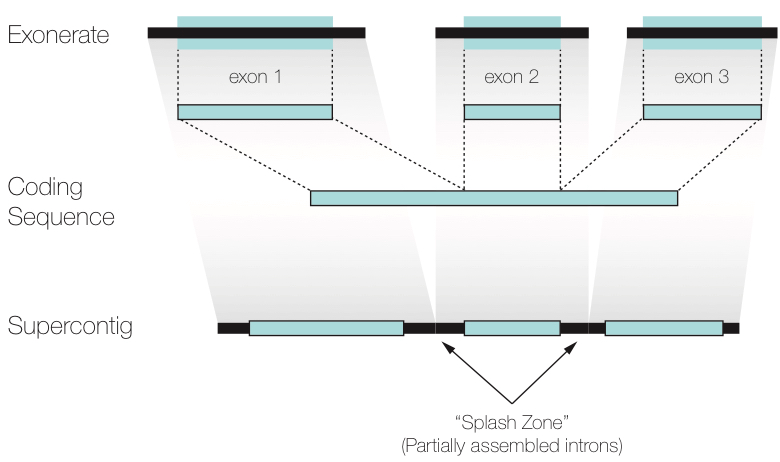

# From Reads to Sequences with HybPiper

## Learning Objectives

1.	Construct a target file for HybPiper.
2.	Run HybPiper for multiple samples and evaluate enrichment efficiency and target recovery efficiency.
3.	Extract intron sequences and compare to exon-only sequences. 
4. Identify putative paralogous gene copies and whether they will interfere with phylogenetic analysis.

More information and the software package can be accessed at: https://github.com/mossmatters/HybPiper

**On the Atmosphere instance, HybPiper is located here: `/usr/local/HybPiper`** 

## Test Dataset

Download and unpack the reads for the test dataset:

```
cd
mkdir hybpiper_test
cd hybpiper_test
wget https://github.com/mossmatters/HybPiper/raw/develop/test_dataset/test_reads.fastq.tar.gz
tar -zxf test_reads.fastq.tar.gz
```

This archive contains contains paired reads from nine samples chosen from the initial HybPiper manuscript. It includes six "ingroup" samples (genus *Artocarpus*) and three outgroup samples. Each sample has a pair of `fastq` files, representing the forward and reverse read, generated on an Illumina MiSeq 2x300 platform.  

The target file for this analysis is located at: `/usr/local/HybPiper/test_dataset/test_targets.fasta`. It is a file containing the full coding sequence from 13 target genes based on the Artocarpus probe set described in the HybPiper manuscript. There are two "sources" of sequence for each target: *Artocarpus* (sequences from a draft genome in the target group) and *Morus* (a reference genome in the same family as *Artocarpus*). For example, both of these sequences represent `gene002`:

```
>Artocarpus-gene002
ATGATGAAGCAGGACGCCACCAACGGCGGCGAGAACTGGGTGCGCGTGTGCGACACGTGC
CGCTCGGCGGCGTGCACGGTTTACTGCCGCGCCGACTCGGCTTACCTCTGCGCCGGATGC
>Morus-gene002
ATGATGAAGGAGGACACAAACGGGGGCAACTCCAGCAAGAACTGGGCGCGCGTGTGTGAC
ACGTGCCGTTCCGCGGCGTGCGCGGTGTACTGCCGTGCCGACTCGGCGTACCTTTGCGCG
```

Having multiple sources for each gene increases the likelihood that reads will map to the targets during the first phase. HybPiper then chooses the version with the best overall mapping score to serve as a reference for extracting coding sequences.

Another useful file is `/usr/local/HybPiper/test_dataset/namelist.txt`. This is a text file containing the list of sample names, one per line. While not required, this file will help run the main HybPiper script and post-processing scripts on multiple samples.

Copy both `namelist.txt` and `test_targets.fasta` to your `hybpiper_test` directory.


## Running HybPiper

The main script of HybPiper is `reads_first.py`. HybPiper needs sequencing reads and a file containing the target coding sequences, in either amino acid or nucleotides. 

HybPiper is run separately for each sample, and generates a directory that contains all of the output files, organized by gene. 

Run this command from the `hybpiper_test` directory:

`/usr/local/HybPiper/reads_first.py -b test_targets.fasta -r NZ281_R*_test.fastq --prefix NZ281 --bwa`

Using the wild card (asterisk) saves some typing and instructs HybPiper to use both the R1 (forward) and R2 (reverse) read files. The `--prefix` flag will be the name of the directory genreated by HybPiper, as well as the identifier for all sequences generated. The `--bwa` flag is required when the target file contains nucleotide sequences. 

HybPiper will generate coding sequences and translated proteins from the sequencing reads in three phases:

1. **Read Mapping**. BLASTX is used if the targets are amino acid sequences, and BWA is used if the targets are nucleotide sequences. Sequencing reads that map to each gene are sorted into separate directories. Liberal parameters for mapping quality are used to ensure the maximum number of reads are used for contig assembly.
2. **Contig assembly**. Each gene is assembled separately from the pool of reads identified in the first step. Assembly is conducted using SPAdes, which automatically detects the best k-mer values to use. If one or more k-mer values fails (usually due to lack of depth), HybPiper re-runs SPAdes with smaller k-mer values.
3. **Coding Sequence Extraction** First, HybPiper uses Exonerate to align the contigs to the appropriate target sequence. Next, the contigs are sorted according to their alignment position. If there is one contig that represents the entire aligned portion, it is chosen. Otherwise, a set of selection criteria are applied, including length of alignment to the target locus, percent identity between the contig and the target, and depth of coverage. 

Briefly, if two contigs have non-overlapping alignments to the reference, they are combined into a "supercontig" and Exonerate is run again, for more accurate detection of intron boundaries. If two contigs have similar alignment to the target sequence, the contig with the longer alignment is chosen. If two contigs have identical alignment positions, but one contig has a much greater depth of coverage (10x more by default), it is chosen. If they both have similar depth, the contig with the greater percent identity to the target is chosen.

## Running Multiple Samples

Although HybPiper is set up to run on each sample separately, if the input files are organized and named appropriately, it is easy to set up and run HybPiper on multiple samples consecutively.

Here, we will employ a "while loop" to get the names of samples from a file `namelist.txt` and use that name as a variable to access the names of read files and set the `--prefix` flag. From the `hybpiper_test` directory:

```
while read name 
do /usr/local/HybPiper/reads_first.py \
  -b test_targets.fasta \
  -r "$name"_R*.fastq \
  --prefix $name \
  --bwa
done < namelist.txt
```
This should take only a few minutes to run through every sample. The "while loop" syntax and the `namelist.txt` file will also be used for other post-processing scripts later in the tutorial.

## Visualizing Results

A heatmap is one way to get a quick glance of the overall success of HybPiper in recovering coding sequences. To generate the heatmap, we first need to collect the length of coding sequence recovered by HybPiper for each gene and sample. This uses the script `get_seq_lengths.py`:

`python /usr/local/HybPiper/get_seq_lengths.py test_targets.fasta namelist.txt dna > test_seq_lengths.txt`

The first line of `test_seq_lengths.txt` has the names of each gene. The second line has the length of the target gene, averaged over each "source" for that gene. The rest of the lines are the length of the sequence recovered by HybPiper for each gene. If there was no sequence for a gene, a 0 is entered.

To use the heatmap script `gene_recovery_heatmap.R`, open the script in an interactive R session in the VCN Viewer. RStudio is located in the Programming section of the Applications menu. 

First, install two R packages, `gplots` and `heatmap.plus`. On the sixth line of the script, enter the full path to your `test_seq_lengths.txt` file, and then execute the entire script.

This should plot a heatmap representing HybPiper's success at recovering genes at each locus, across all the samples. 


Each column is a gene, and each row is a sample. The darkness of shading in each cell represents the length of the sequence recovered, expressed as a percentage of the length of the target gene. In the test dataset, most genes worked very well, bu it is easy to see at a glance that some samples did not work well (NZ874) and some genes did not work as well (gene022).

## Summary Statistics

`hybpiper_stats.py`

This script will summarize target enrichment and gene recovery efficiency for a set of samples. The output is a text file with one sample per line and the following statistics:

- Number of reads
- Number of reads on target
- Percent reads on target
- Number of genes with reads
- Number of genes with contigs
- Number of genes with sequences
- Number of genes with sequences > 25% of the target length
- Number of genes with sequences > 50% of the target length
- Number of genes with sequences > 75% of the target length
- Number of genes with sequences > 150% of the target length
- Number of genes with paralog warnings

**NOTE**: The number of reads and percent reads on target will only be reported if mapping was done using BWA.

**Example Command Line**

`python /usr/local/HybPiper/hybpiper_stats.py test_seq_lengths.txt namelist.txt > test_stats.txt`


## Retrieving Sequences

`retrieve_sequences.py`

This script fetches the sequences recovered from the same gene for many samples and generates an unaligned multi-FASTA file for each gene. 

This script will get the sequences generated from multiple runs of the HybPiper (reads_first.py).
Have all of the runs in the same directory (sequence_dir). 
It retreives all the gene names from the target file used in the run of the pipeline.

#### Example Command Line

`python /usr/local/HybPiper/retrieve_sequences.py test_targets.fasta . dna`

You must specify whether you want the protein (aa) or nucleotide (dna) sequences.

If you ran `intronerate.py` on these samples, you can also specify "supercontig" or "intron" to recover those sequences instead.

The script will output unaligned FASTA files, one per gene, to the current directory.

## Introns 

One of the attractive features of HybSeq is the ability to target relatively conserved regions of the genome (exons) while also capturing more variable flanking regions (introns). In order to extract exon sequences, HybPiper arranges assembled contigs into a "supercontig" that contains exons and flanking intron sequences. The supercontigs are saved in the HybPiper output file and can be extracted using the script `intronerate.py`.




Given a completed run of `reads_first.py` for a sample, run the script `intronerate.py` to generate "gene" sequences for each locus. The script will generate two new sequence files for each gene:

**supercontig**: A sequence containing all assembled contigs with a unique alignment to the reference protein, concatenated into one sequence.

**introns**: The supercontig with the exon sequences removed.

	python /usr/local/HybPiper/interonerate.py --prefix hybseq_directory
	
Specify the name of a directory generated by ```reads_first.py``` in the prefix argument.

The default behavior is to refer to the file `genes_with_seqs.txt` to recover full length sequences only for the genes where exons were previously recovered. You may optionally supply a file containing a list of genes with `--genelist filename`

**NOTE**: The script will extract all sequence *NOT* annotated as exons by exonerate. This may be introns (or intergenic sequence), but it may also be mis-assembled contigs. While it may be difficult ot tell whether the sequence is "real" from a single sample, I recommend running `intronerate.py` on several samples. Then, extract the supercontig sequences with `retrieve_sequences.py` and align them. Sequences that appear in only one sample are probably from mis-assembled contigs and may be trimmed, for example using Trimal.


## Assessing Paralogs

When running the main script, you may notice occasional warnings about paralogs. These warnings are triggered when HybPiper detects multiple contigs containing long coding sequences-- by default at least 85% of the reference sequence. HybPiper will choose among these competing long contigs by first checking whether one of the contigs has coverage depth that greatly exceeds the others (10x by default). If all competing long contigs have similar depth, the sequence with the greatest percent identity to the reference is chosen.

These criteria may not be ideal in all cases, especially in the event of gene (or genome) duplication. Choosing the appropriate gene copy to use for phylogenetics requires careful consideration, and HybPiper flags the genes that may require further attention. Note that there may be other reasons for multple long-length contigs: recent polyploidy, contamination, or even allelic variation may result in multiple reads.

HybPiper includes a post-processing script, `paralog_investigator.py` to extract coding sequences from alternative contigs. To run it on the test data, use the `namelist.txt` file and a while loop:

```
while read i
do
echo $i
python ../paralog_investigator.py $i
done < namelist.txt
```

The script will report the number of paralogs found for each gene. If many samples have more than one copy for many genes, it may indicate an ancient gene duplication. If one sample tends to have many copies, it may indicate it is a polyploid.

Paralog coding sequences are extracted into a file located at: `prefix/gene/prefix/paralogs/gene_paralogs.fasta`

Not all samples have paralog warnings, such as EG30. Some genes do not have any paralogs found, such as gene001. However, HybPiper recovered coding sequence from two contigs in the sample EG98 for gene002:

```
>EG98.0 NODE_4_length_1358_cov_56.9293_ID_43,Artocarpus-gene002,17,282,89.27,(-),1358,572
>EG98.main NODE_3_length_1380_cov_111.618_ID_41,Artocarpus-gene002,0,282,91.49,(+),17,869
```

The `main` refers to the paralog that was chosen during the initial run of HybPiper. The original names of the contigs from SPAdes is also shown. The `main` contig had about twice as much depth of coverage as the other paralog (111x vs 57x), and also had a higher percent identity (91.49% vs 87.27%).

Are these two sequences paralogs or alleles? The best way to check is to use multiple samples and build gene trees from the sequences. HybPiper includes the script `paralog_retriever.py` for this task. `paralog_retriever.py` will collect all paralogs from each sample in `namelist.txt`, along with all coding sequences from samples without paralogs, and output them to "standard output." If you have a list of genes for which you want to assess paralogs, you can use GNU Parallel:

`parallel "python paralog_retriever.py namelist.txt {} > {}.paralogs.fasta" ::: gene002 gene006 gene030`

The output to the screen should look like this:

```
gene030	1	6	4	1	5	1	4	4	4
gene006	1	2	2	1	2	1	2	2	2
gene002	1	2	2	1	2	1	2	2	2
```
This shows the number of paralogs for each gene. The columns are in the same order as `namelist.txt`.

The unaligned FASTA files generated by `paralog_retriever.py` can be used in a phylogenetics pipeline to align and reconstruct a phylogeny. If you have `mafft` and `FastTree` installed, you can create the tree directly from `paralog_retriever.py` using pipes:

`python ../paralog_retriever.py namelist.txt gene074 | mafft --auto - | FastTree -nt -gtr > gene074.paralogs.tre`


From the tree above (plotted using FigTree), you can see that for each species, the two sequences recovered form a clade. This means there is no evidence of an ancient duplication event for this gene. There may be another explanation for why HybPiper commonly found two competing sequences, such as alleles. For phylogenetics, choosing the `main` sequence for each species is sufficient. 

Other genes have more complicated histories: 

`python ../paralog_retriever.py namelist.txt gene002 | mafft --auto - | FastTree -nt -gtr > gene002.paralogs.tre`


We see that there are two distinct clades of sequences, sister to a clade of the outgroups (NZ874, EG30, and NZ281). The `main` sequences form one clade, meaning that this gene had an ancestral duplication within the outgroup. 

Cases like the one above were common in the *Artocarpus* data on which the test dataset is based. By investigating each gene tree, it is possible to delineate which sequence is appropraite for phylogenetics. However, some samples may be missing one or both copies of the duplicated gene. Although the genes may really be lost, it is also possible that HybPiper was not able to recover both copies. 

To test this possibility, one option is to create a new target file for HybPiper that includes examples of both copies. HybPiper will map reads against each copy separately, treating them as separate loci. For the *Artocarpus* dataset, this allowed us to nearly double the number of "loci" for phylogenetics! 


## Exercise

* Run `reads_first.py` and `intronerate.py` on each sample the test dataset.
* Open a gene in Aliview using the VNC Viewer and align the sequences (Align menu --> Realign Everything). Aliview uses MUSCLE as its default alignment program.
* Compare the FNA alignment to the supercontig alignment. How does the addition of intron regions affect the sequence alignment?
* Run `paralog_invesitgator.py` to identify genes in the test dataset that may have paralogous copies. For one such gene, run `paralog_retriever.py` and generate a gene tree. How will the paralog pattern of this gene affect phylogenetic inference?

## Further Reading

Weitemier, K., Straub, S. C. K., Cronn, R. C., Fishbein, M., Schmickl, R., McDonnell, A., & Liston, A. (2014). Hyb-Seq: Combining Target Enrichment and Genome Skimming for Plant Phylogenomics. Applications in Plant Sciences, 2(9), 1400042. doi:10.3732/apps.1400042 (http://www.bioone.org/doi/10.3732/apps.1400042)

Johnson M.G., E.M. Gardner, Y. Liu, R. Medina, B. Goffinet, A.J. Shaw, N.J.C. Zerega, & N.J. Wickett. 2016. HybPiper: Extracting Coding Sequence and Introns for Phylogenetics from High-Throughput Sequencing Reads Using Target Enrichment. APPS 4(7):1600016. (http://www.bioone.org/doi/abs/10.3732/apps.1600016)

Faircloth BC. 2016. PHYLUCE is a software package for the analysis of conserved genomic loci. Bioinformatics 32:786–788. (https://academic.oup.com/bioinformatics/article-lookup/doi/10.1093/bioinformatics/btv646)

